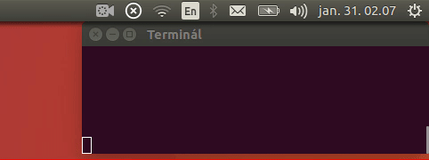

# IndicatorPanel

IndicatorPanel is a small python script for Ubuntu that creates an indicator in the top panel so you can run custom terminal commands.



## Setup

The only dependency is python, but that comes with Ubuntu by default.

To start the app just type:

```sh
python indicator.py
```

Or even better, run it as a background process:

```sh
chmod +x indicator.py # First, make the script executable
nohup indicator.py & # Run it in background
```

To autostart this script just add this command (with an absolute path to the script file) to the [Startup Applications](https://help.ubuntu.com/16.04/ubuntu-help/startup-applications.html):

## Usage

Add your commands to the `data.commands.json` file. There are two parts of the app.

### Indicated start/stop scripts

This is a toggleable part of the app whose status is indicated in the panel.

- When you click "Start", the scripts in the `start` array will be run and the indicator will display the `icons\online.svg` icon. You can't execute start scripts again until you press "Stop".
- When you click "Stop", the scripts in the `stop` array will be run and the indicator will display the `icons\offline.svg`. You can't execute stop scripts again until you press "Start".

You can have only one indicated start/stop script block per app, but you can run the script multiple times to have more apps.

### Other scripts

You can create multiple general scripts that can be run in any state of the app, just add objects to the `other` array that has:

- A `label` property with a string containing the text of the dropdown's menu item.
- A `commands` property containing an array of strings that can be run as commands when you click the menu item.

## License

GPLv3

## Attribution & Third Party Stuff

Made with the help of these tutorials:

- [Official Ubuntu guide](https://wiki.ubuntu.com/DesktopExperienceTeam/ApplicationIndicators#Python_version)
- [A great blog post](http://candidtim.github.io/appindicator/2014/09/13/ubuntu-appindicator-step-by-step.html)

Used these 3rd party software:

- [Default icons are from Material Design Icons](https://github.com/google/material-design-icons/)
